# 🎬 Quality Movie Data Analysis Project using AWS

This project demonstrates an **end-to-end automated data pipeline** using AWS services to perform **data ingestion, data quality validation, transformation, and analytics** for IMDb movie datasets.
It leverages **AWS Glue, Redshift, EventBridge, Step Functions, and SNS** to ensure a fully serverless, scalable, and event-driven data pipeline.

---

## 🚀 Project Overview

The pipeline automates the process of:

1. Crawling and cataloging raw IMDb movie data from **Amazon S3**
2. Performing **data quality checks** using **AWS Glue Data Quality**
3. Loading **validated and curated data** into **Amazon Redshift**
4. Sending **success/failure notifications** via **SNS**
5. Orchestrating all components using **AWS Step Functions** and **EventBridge**

---

## 🏗️ Architecture Diagram

Here’s the high-level system architecture illustrating the AWS services and data flow:

### 🖼️ Main Architecture

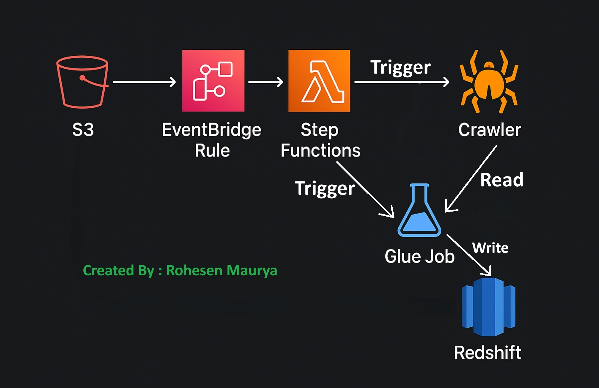

---

## 🧰 AWS Services Used

| Service                    | Purpose                                              |
| -------------------------- | ---------------------------------------------------- |
| **Amazon S3**              | Stores raw and processed IMDb movie data             |
| **AWS Glue Crawler**       | Automatically infers schema and updates Glue Catalog |
| **AWS Glue Data Catalog**  | Central metadata repository                          |
| **AWS Glue Data Quality**  | Evaluates completeness and range-based data quality  |
| **AWS Glue ETL (PySpark)** | Performs transformations and schema mappings         |
| **Amazon Redshift**        | Stores curated, query-ready movie data               |
| **Amazon EventBridge**     | Triggers Step Function executions automatically      |
| **AWS Step Functions**     | Orchestrates pipeline flow                           |
| **Amazon SNS**             | Sends notifications for success or failure           |

---

## 🧮 Dataset

**File:** `imdb_movies_rating.csv`
**Records:** ~400,000
**Columns:**

```
Poster_Link, Series_Title, Released_Year, Certificate, Runtime, Genre,
IMDB_Rating, Overview, Meta_score, Director, Star1, Star2, Star3, Star4,
No_of_Votes, Gross
```

---

## 🧩 AWS Glue ETL Job (`movies_quality_ingestion_glue.py`)

### Key Steps:

1. **Read data** from Glue Catalog (S3 source).
2. **Evaluate data quality** using:

   * Completeness check on `imdb_rating`
   * Valid range rule: `imdb_rating` between 8.0 and 10.3
3. **Route failed records** to `s3://movies-gds/bad_records/`
4. **Store rule outcomes** to `s3://movies-gds/rule_outcome_from_etl/`
5. **Transform schema** and **load cleaned data** into Redshift table `movies.imdb_movies_rating`

### Example Rule Set:

```python
Rules = [
    IsComplete "imdb_rating",
    ColumnValues "imdb_rating" between 8.0 and 10.3
]
```

---

## 🗃️ Redshift Table Script (`redshift_tables_for_imdb.txt`)

```sql
CREATE SCHEMA movies;

CREATE TABLE movies.imdb_movies_rating (
    Poster_Link VARCHAR(MAX),
    Series_Title VARCHAR(MAX),
    Released_Year VARCHAR(10),
    Certificate VARCHAR(50),
    Runtime VARCHAR(50),
    Genre VARCHAR(200),
    IMDB_Rating DECIMAL(10,2),
    Overview VARCHAR(MAX),
    Meta_score INT,
    Director VARCHAR(200),
    Star1 VARCHAR(200),
    Star2 VARCHAR(200),
    Star3 VARCHAR(200),
    Star4 VARCHAR(200),
    No_of_Votes INT,
    Gross VARCHAR(20)
);
```

---

## 🔁 Step Function Configuration (`step_function_config.json`)

### Workflow Summary

| Step                         | Description                         |
| ---------------------------- | ----------------------------------- |
| **StartCrawler**             | Runs Glue crawler for schema update |
| **GetCrawler / Is_Running?** | Waits for crawler completion        |
| **Glue StartJobRun**         | Executes Glue ETL job               |
| **Glue_Job_Status**          | Checks success/failure              |
| **SNS Notifications**        | Sends success or failure message    |

### SNS Topic:

`arn:aws:sns:us-east-1:851725469799:first_sns`

---

## ⏰ EventBridge Configuration (`event_bridge_rules.txt`)

EventBridge triggers the Step Function automatically when:

* A new file is uploaded to the S3 raw input folder, or
* On a scheduled interval (e.g., daily refresh).

---

## 🧠 Data Quality Outputs

| Output Type        | Location                                 | Description                                 |
| ------------------ | ---------------------------------------- | ------------------------------------------- |
| **Rule Outcomes**  | `s3://movies-gds/rule_outcome_from_etl/` | JSON reports of applied data quality checks |
| **Failed Records** | `s3://movies-gds/bad_records/`           | Records that failed DQ validation           |
| **Curated Data**   | Redshift (`movies.imdb_movies_rating`)   | Cleaned and validated dataset               |

---

## 📸 Project Screenshots

### 🧭 Step Function & Execution Flow

| Screenshot                                                                    | Description                                   |
| ----------------------------------------------------------------------------- | --------------------------------------------- |
| 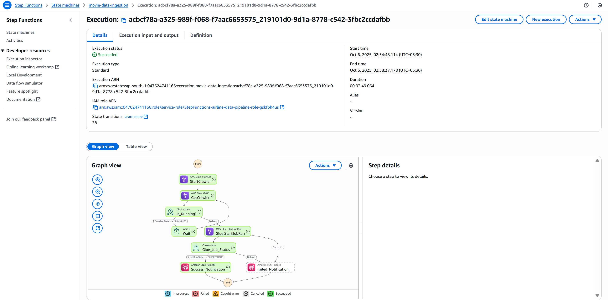 | Step Function execution with SNS notification |
| 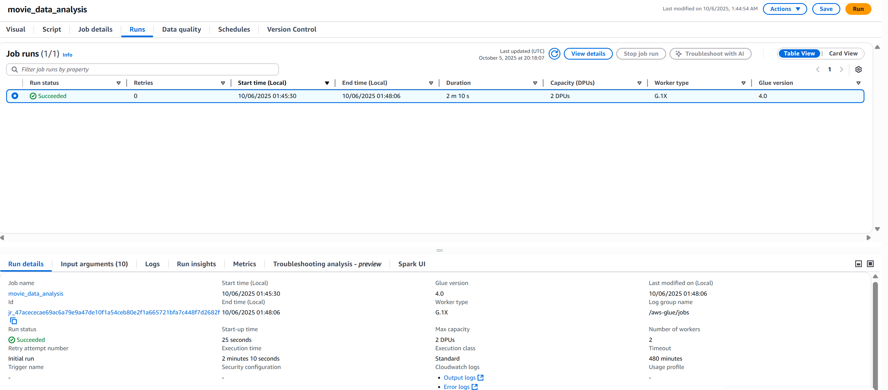                     | first etl run             |

### 🧹 AWS Glue Components

| Screenshot                                           | Description                     |
| ---------------------------------------------------- | ------------------------------- |
| 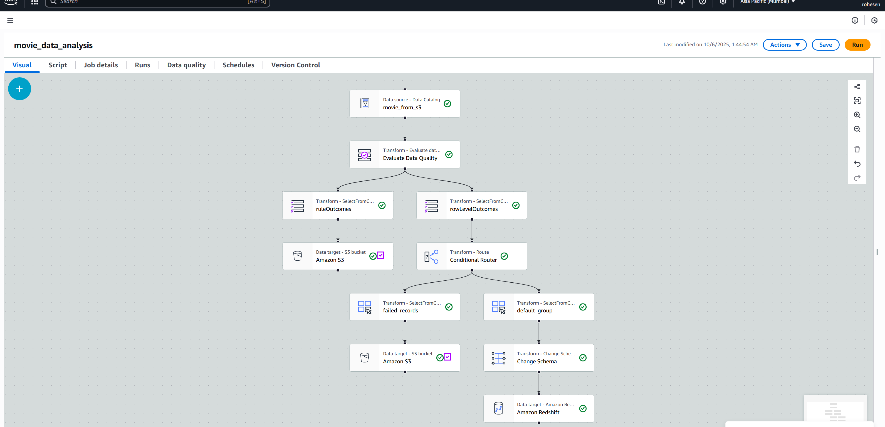         | AWS Glue Visual ETL Job         |
| 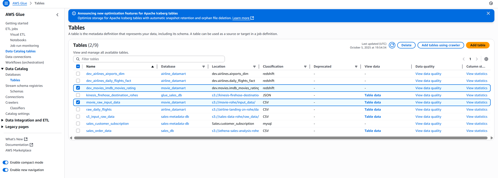 | Glue Data Catalog Table         |
| 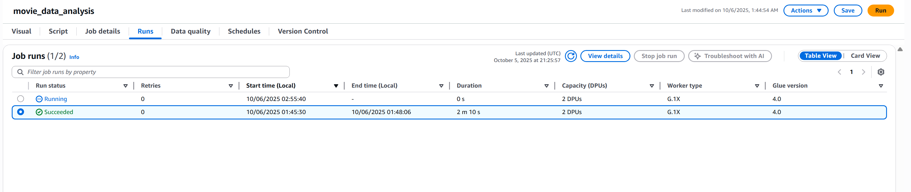        | Glue job in progress            |
| 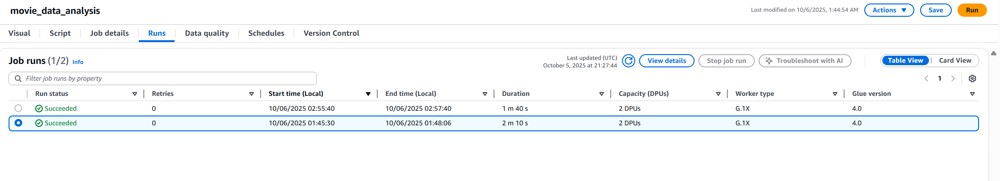      | Glue job completed successfully |

### 📦 S3 Buckets

| Screenshot                                                                                                                                | Description         |
| ----------------------------------------------------------------------------------------------------------------------------------------- | ------------------- |
| 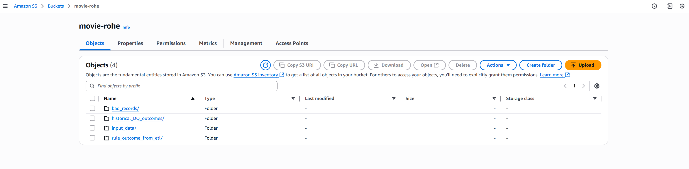 | S3 bucket structure |
| 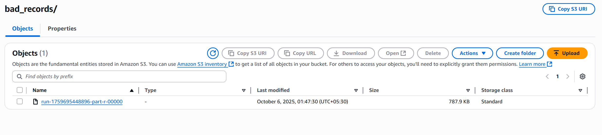                                                                                        | Bad records folder  |
| 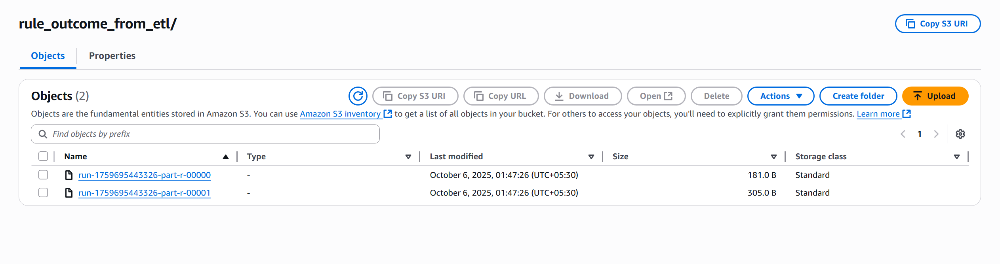                                                                              | Rule outcome folder |

### 🧱 Redshift Database

| Screenshot                                                                           | Description                            |
| ------------------------------------------------------------------------------------ | -------------------------------------- |
| 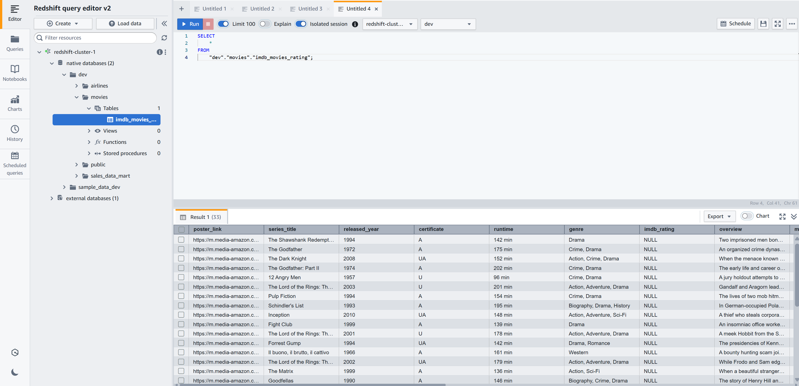                                   | Redshift tables overview               |
| 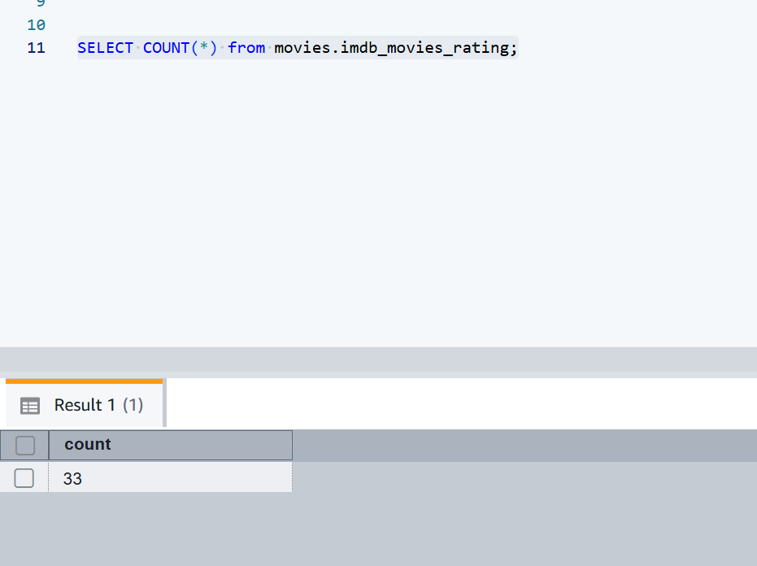             | Initial record count                   |
| 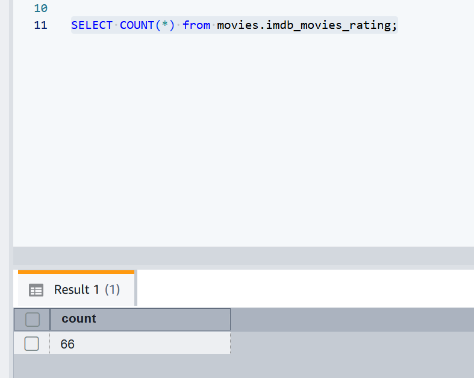 | Updated record count after job success |

### 🧩 Materialized View Updates

| Screenshot                                                                                      | Description               |
| ----------------------------------------------------------------------------------------------- | ------------------------- |
| 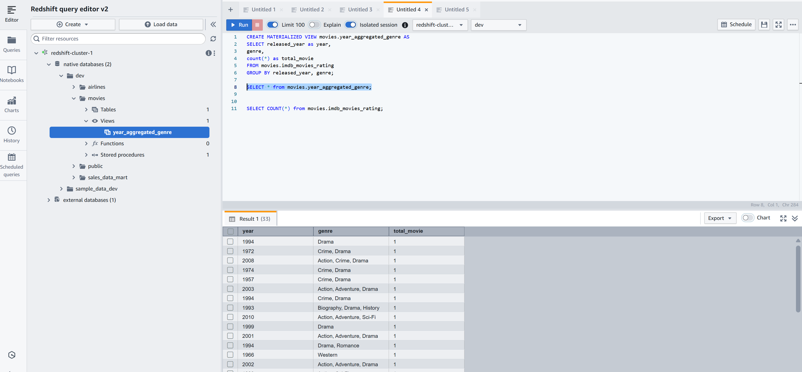            | Initial materialized view |
| 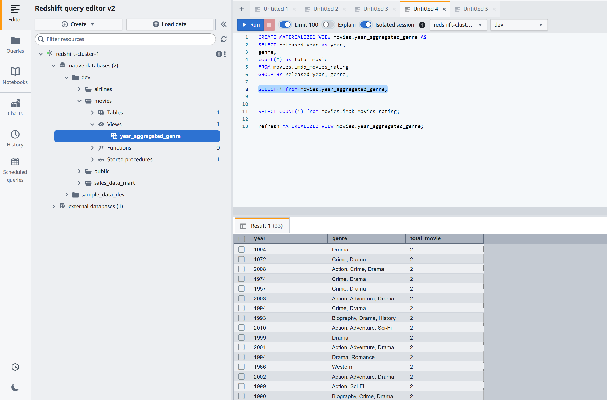 | Updated materialized view |
| 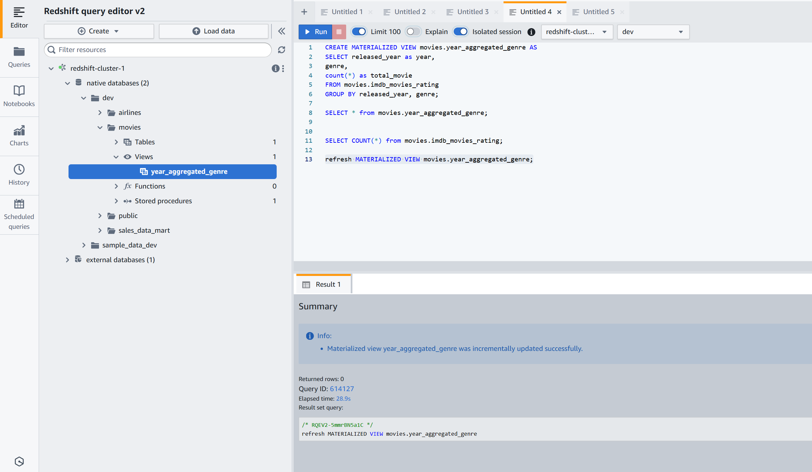                                | View refresh confirmation |

### 🔔 Notifications

| Screenshot                                        | Description                                  |
| ------------------------------------------------- | -------------------------------------------- |
| 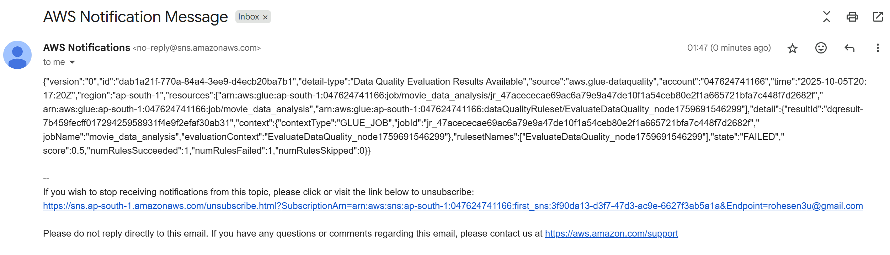 | SNS notification confirming Glue job success |

---

## 📦 Folder Structure

```
Quality_Movie_Data_Analysis_Project_using_AWS/
│
├── architecture.jpg
├── imdb_movies_rating.csv
├── movies_quality_ingestion_glue.py
├── redshift_tables_for_imdb.txt
├── step_function_config.json
├── event_bridge_rules.txt
└── project-screenshots/
    ├── glue-etl-visual.png
    ├── redshift-movie-tables.png
    ├── s3-folder-bad_records.png
    ├── s3-folder-rule_outcome_from_etl.png
    ├── ...
```

---

## 🧠 Key Learnings

* Implemented **serverless data pipelines** using AWS Glue & Redshift
* Automated **data quality validation** using AWS Glue Data Quality
* Designed **event-driven workflows** using Step Functions and EventBridge
* Learned **data lineage tracking** via Glue Catalog & Redshift

---

## 📈 Future Enhancements

* Add **AWS QuickSight dashboards** for analytics
* Use **Athena** for ad-hoc querying on curated data
* Add **dynamic rule definitions** via Glue DQ Ruleset Editor
* Implement **CI/CD automation** for Glue jobs using CodePipeline

---

## 👨‍💻 Author

**Rohesen**
💼 *Data Engineer | Cloud & AWS Enthusiast* 
